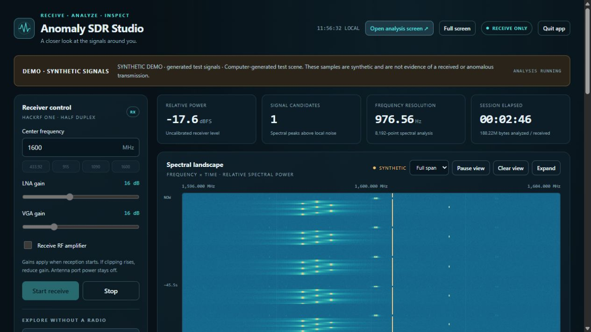
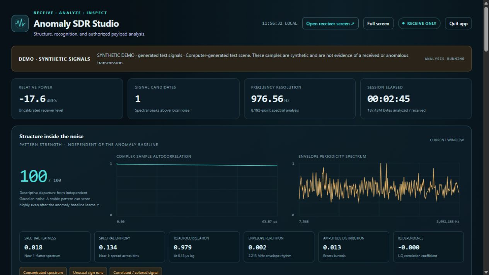

# Anomaly SDR Studio

**A free, local HackRF One dashboard for exploring signals and patterns in raw I/Q data.**

See the spectrum, examine waveform structure, recognize supported telemetry, and inspect packet bytes in two browser workspaces. The app is receive-only. Live reception, generated demos, and recorded captures are always labeled separately.

## Download and start

Download **anomaly-sdr-studio-v0.1.0-windows-x64.zip** from the [GitHub releases](https://github.com/Teylersf/anomaly-sdr-studio/releases/latest).

1. Extract the entire ZIP into a writable folder.
2. Run **StartAnomalySDRStudio.cmd** inside the **AnomalySDRStudio** folder.
3. The dashboard opens at [http://127.0.0.1:8788/](http://127.0.0.1:8788/).

The Windows x64 package includes Python, NumPy, and the native host tools. You do not need to install Python to use it. A working HackRF One USB driver is required for live reception; the app does not install drivers or change device firmware. See [official HackRF installation guidance](https://hackrf.readthedocs.io/en/latest/installing_hackrf_software.html).

Use **StartDemo.cmd** to start a labeled synthetic demonstration without USB access. Use **StartOffline.cmd** for offline demo and replay work. The executable **AnomalySDRStudio.exe** can also run directly. Releases are unsigned; **SHA256SUMS.txt** accompanies the download.

Close other software using the radio before starting live receive. Choose **Stop** to release reception, or **Quit app** to stop reception and close the local service. Opening a workspace does not start reception or transmission.

## Two workspaces

The receiver workspace shows frequency controls, gain, measured spectrum, and the waterfall. Select **Open analysis screen** for the second browser window, move it to another monitor, and use **Full screen** in each workspace. Both windows share the same receiver and service.

The analysis workspace brings together:

- An 8,192-bin spectrum and waterfall at 8 MS/s.
- Raw I/Q constellation, amplitude envelope, phase-increment wheel, and rhythm views.
- Noise-reference structure measurements: spectral flatness, entropy, autocorrelation, amplitude shape, phase concentration, I/Q dependence, and sign runs.
- Frequency occupancy, a recurrence matrix, and candidate repetition intervals across up to 128 observed frames.
- Tentative modulation labels and exploratory OOK/FSK bit extraction using a supplied symbol rate.
- Automatic offline rtl_433 recognition for supported sensor protocols, plus a CRC-checked ASDR-LAB test-packet decoder.
- Byte-format inspection and browser-local supplied-key AES-GCM, AES-CBC, AES-CTR, or single-byte XOR operations.

## Preview

Both screenshots show **software-generated synthetic demo samples**, with no received or private traffic.





## Choose a data source

**Live receive:** choose a center frequency and RX gain, then start reception. This version receives at 8 MS/s. Supported tuning is 1 MHz–6 GHz; LNA gain is 0–40 dB in 8 dB steps and VGA gain is 0–62 dB in 2 dB steps. The RF amplifier starts off. Excessive gain can distort the observations. [Hardware specifications](https://hackrf.readthedocs.io/en/stable/hackrf_one.html), [gain guidance](https://hackrf.readthedocs.io/en/latest/setting_gain.html).

**Demo:** generate a synthetic scene to explore the views without operating the radio. Demo labels remain visible so generated patterns cannot be confused with reception.

**Replay:** analyze a compatible saved capture from `%LOCALAPPDATA%\AnomalySDRStudio\captures`. Files need signed 8-bit interleaved I/Q pairs, a matching JSON sidecar, an 8 MS/s sample rate, and a size of at most 256 MiB. Replay repeats by default and marks each boundary as a gap. See [capture format](docs/CAPTURES.md).

Runtime data uses `%LOCALAPPDATA%\AnomalySDRStudio` by default. Receiver settings belong to the current session and are not saved for the next launch. `--data-dir` selects a different writable folder. No account or cloud service is needed.

## Interpret the results

| Output | Useful meaning | Limit |
| --- | --- | --- |
| Structure score | Correlation, repetition, or distribution shape that differs from independent circular Gaussian noise | Colored noise, filtering, receiver imbalance, and clipping can also score highly |
| Novelty score | Positive spectral change relative to a rolling session baseline | The first eight usable updates warm up that baseline; ordinary activity can be new |
| Occupancy and recurrence | Frequency footprints that persisted or appeared again at measured instants | Gaps are unobserved; matching footprints do not identify a transmitter |
| Modulation and candidate bits | A provisional interpretation worth inspecting | A symbol-rate guess and printable bytes do not validate a protocol |
| Recognized telemetry | A supported rtl_433 format matched the observation | Some protocols have no checksum; recognition is weaker than checked integrity |
| CRC-valid ASDR-LAB frame | A complete lab packet passed its framing and checksum rules | CRC does not authenticate its sender |
| Supplied-key decryption | Bytes recovered using the chosen method, key, and parameters | GCM checks a tag; CBC, CTR, and XOR output remain unauthenticated |

Structure analysis is independent of the novelty baseline, so a steady tone can stay visible after the baseline adapts. It examines several useful kinds of patterns; it cannot detect every possible pattern or determine a signal's origin.

Relative levels are not calibrated dBm, field strength, or distance. Receiver DC offset can create a line near the tuned center, and overload can create additional apparent frequencies. An 8,192-point FFT at 8 MS/s has **976.5625 Hz bin spacing**; that is a frequency grid, not guaranteed separation of signals 977 Hz apart. [DC offset guidance](https://hackrf.readthedocs.io/en/latest/troubleshooting.html#there-is-a-big-spike-in-the-center-of-the-received-spectrum), [FFT bin definition](https://numpy.org/doc/2.2/reference/generated/numpy.fft.fftfreq.html).

Automatic rtl_433 attempts target common sensor bands at 168–170, 300–350, 420–450, and 860–930 MHz. The pinned 25.12 catalog has 284 entries, with 253 enabled by default. These counts describe decoder coverage, not a promise to decode every signal. Arbitrary cellular, Wi-Fi, or satellite protocols are outside this integration.

**Demodulation, decoding, and decryption are separate stages.** For decryption, supply the correct method, key, nonce/IV/counter, frame boundaries, and any required tag or authenticated data. Automatic attempts use only an explicit profile on recognized packets that provide usable raw bytes. Keys and decrypted previews stay in browser memory; **Clear keys and bytes** clears those fields. The workbench does not discover unknown encryption parameters or recover unknown keys. [Browser decryption API](https://developer.mozilla.org/en-US/docs/Web/API/SubtleCrypto/decrypt).

See [How it works](docs/HOW_IT_WORKS.md) for the processing chain and interpretation limits.

## Run from source

Use Python 3.13 x64 for the documented Windows setup:

```powershell
python -m venv .venv
.\.venv\Scripts\python.exe -m pip install -r requirements.txt
.\.venv\Scripts\python.exe launch.py
```

Native binaries for live reception and optional decoding must be prepared separately when running a fresh source checkout; see [Build instructions](docs/BUILD.md). Offline synthetic analysis can run without a radio.

The original application code is [MIT licensed](LICENSE). Bundled third-party tools and runtimes retain their own licenses; see [Third-party notices](THIRD_PARTY_NOTICES.md). The release includes a matching source archive and checksums.
