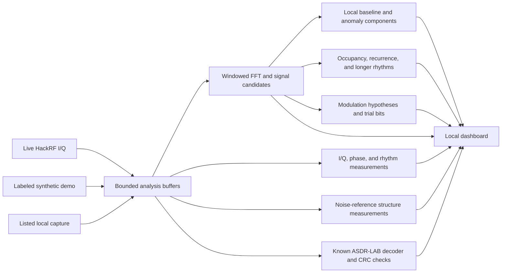

# How Anomaly SDR Studio works

The browser displays measurements made by a local Python service. In live mode the service receives signed 8-bit interleaved I/Q bytes from HackRF. Demo mode generates clearly labeled samples in software. Replay reads an app-listed local capture from the writable data folder; see [capture format](CAPTURES.md). The signal analysis operates on samples from the selected source; it never transmits.



## Raw samples and the receiver

Each complex sample contains an I component and a Q component. Together they represent a waveform's amplitude and phase relative to the receiver's tuned frequency. Positive and negative baseband offsets map to frequencies above and below that tuning center. A raw byte file does not contain its center frequency or sample rate; those settings must accompany a replay to interpret its axes correctly.

The initial live and replay profiles use 8 MS/s. Live tuning accepts 1 MHz through 6 GHz. RX RF amplification starts off; gain controls enforce the device's LNA and VGA steps. Replay accepts an app-listed capture ID, rather than an arbitrary path. Supported files have paired signed 8-bit I/Q bytes and JSON metadata, are at most 256 MiB, and specify 8 MS/s. Replays repeat by default. Each repeat boundary emits a gap and clears pending decoder samples, so the end and beginning cannot be joined into a fabricated frame.

HackRF One uses 8-bit quadrature samples and supports 2–20 MS/s. Its hardware is half duplex; Anomaly SDR Studio uses reception only. The official sampling guidance recommends at least 8 MS/s because the analog baseband filter does not adequately reject adjacent-band energy at the lowest sample rates. The first live profile uses 8 MS/s. [HackRF One specifications](https://hackrf.readthedocs.io/en/stable/hackrf_one.html), [sampling and baseband filters](https://hackrf.readthedocs.io/en/latest/sampling_rate.html).

RX has three gain stages: an on/off RF amplifier with roughly 11 dB nominal gain, LNA gain from 0–40 dB in 8 dB steps, and VGA gain from 0–62 dB in 2 dB steps. RF gain varies with frequency. Increasing gain can reveal a weak signal, but excessive gain can cause distortion, new apparent frequencies, and clipping. Those effects can also trigger anomaly detectors. [Official gain guidance](https://hackrf.readthedocs.io/en/latest/setting_gain.html).

Eight million complex samples per second, at two bytes per sample, produce 16 MB/s of raw data. The dashboard summarizes bounded windows for display; a visualization is not a lossless recording of everything that passed through the receiver. Missing or stopped reception must remain a gap, rather than being interpreted as zero signal or joined into a continuous message.

Live receive uses finite 30-second capture windows with checked child shutdown before reopening the device. Each boundary is marked as a gap and clears pending packet buffers. This bounds each radio operation while leaving enough uninterrupted observations for longer rhythm analysis. Stop interrupts the active window; it does not wait for the entire window to finish.

The service pauses briefly between windows. Exact zero-sample startup failures for access denial or a temporarily missing device, and specifically identified partial-transfer stalls, receive at most three consecutive attempts with checked cleanup. Other errors stop the source. Retry counts and gaps stay visible; a failed cleanup remains an error rather than a confirmed shutdown.

## Spectrum and waterfall

An FFT splits a finite sample window into frequency components. NumPy supplies the complex transform, frequency-bin centers, and the shift that places zero offset in the middle of the plot. The service subtracts each window's complex mean to suppress DC, then applies a Hann window to soften discontinuities at its edges. This suppression can affect real energy near the tuned center. Each analysis update averages linear spectral power from up to 32 complete, non-overlapping 8,192-sample windows. The input buffer is capped at 262,144 complex samples, or 32.768 ms at 8 MS/s. Short data is not padded into a higher-resolution measurement. [NumPy FFT](https://numpy.org/doc/2.2/reference/routines.fft.html), [Hann window](https://numpy.org/doc/2.2/reference/generated/numpy.hanning.html).

For a sample rate `Fs` and FFT length `N`:

```text
bin spacing = Fs / N
window duration = N / Fs

8,000,000 / 8,192 = 976.5625 Hz per bin
8,192 / 8,000,000 = 1.024 ms per FFT window
```

NumPy's bin formula supports this grid spacing. Useful separation of nearby signals also depends on window shape, available samples, signal strength, interference, and clock stability. Enlarging the waterfall or interpolating its colors cannot add measurements. A brief transmission can occur between display snapshots. [FFT frequency-bin definition](https://numpy.org/doc/2.2/reference/generated/numpy.fft.fftfreq.html).

The main spectrum and waterfall retain 8,192 frequency bins. The compact within-window spectrogram averages linear power into 256 display columns, so it has coarser frequency detail. Both views report relative digital levels. Conversion to RF power needs a calibrated receiver, gain and frequency response measurements, and the relevant bandwidth and antenna setup. A brighter pixel alone does not establish greater transmitted power or closer distance.

## Candidate detection and modulation hypotheses

The detector estimates a floor from the 25th percentile of spectral-bin levels outside the center mask. With at least eight averaged FFT windows, its threshold is the larger of floor + 9 dB and strongest non-center bin − 50 dB. Shorter captures raise the floor margin, up to 21 dB for a single FFT window, to reduce noise-only detections. It joins active bins separated by up to two inactive bins into candidates and retains up to 12, ranked by peak level. This peak-to-floor ratio is an approximate detection contrast, rather than a calibrated receiver SNR. Seven bins around the tuned center and two at each band edge are excluded from candidate detection. Weak signals below these thresholds or outside the retained candidates may be missed. Reported occupied bandwidth contains 99% of power within a detected group; it does not recover energy excluded by the threshold.

Frequency width, amplitude variation, and phase differences can support simple hypotheses such as a narrow carrier, OOK-like bursts, or FSK-like frequency switching. The strongest candidate is filtered and shifted to baseband for closer analysis; similarly strong nearby peaks may be provisionally included as a possible FSK tone pair. The suggestions include their observed evidence and qualitative confidence. These are heuristic descriptions, not probabilities calibrated against all possible radio systems.

Several different waveforms can produce similar features. A fading carrier can look amplitude-keyed; frequency drift can resemble FSK; multiple simultaneous emitters can look like one complicated signal. A wide noise-like band can be ordinary modulation, interference, overload, or encrypted traffic. Its shape cannot establish encryption.

Trial OOK extraction thresholds amplitude. Trial FSK extraction separates estimated frequency states. The operator supplies a candidate symbol rate; the first version does not autonomously recover the correct rate or protocol. Timing remains provisional, so the resulting bit strings remain candidates. Frequency error, timing error, line coding, whitening, scrambling, forward error correction, or the wrong modulation hypothesis can all change those bits. Rendering trial bytes as ASCII does not make them a validated message.

A standards decoder needs the actual protocol's synchronization, channel filtering, symbol recovery, coding, framing, and integrity rules. The included rtl_433 engine recognizes named supported sensor protocols. It does not automatically decode arbitrary satellite, cellular, Wi-Fi, or other standards merely because it detects their energy.

## Automatic protocol and byte-format recognition

The optional pinned rtl_433 25.12 executable operates on finite local I/Q files, using its file-only build and an explicit empty configuration. It does not open another SDR or transmit. Its catalog has 284 protocol entries, with 253 enabled by default; this describes its supported decoder collection, not a guarantee that every received signal is recognizable. The official release includes support for named weather, environmental, and other telemetry devices. [rtl_433 25.12 release](https://github.com/merbanan/rtl_433/releases/tag/25.12).

The first integration tries bounded captures around known common sensor bands: 168–170, 300–350, 420–450, and 860–930 MHz. It skips automatic rtl_433 attempts at the 1.600 GHz preset. HackRF signed-byte samples are converted to rtl_433's unsigned-byte format. A 32-sample boxcar reduction produces a 250 kS/s input from 8 MS/s; its limited rejection of out-of-band energy is a practical limitation, so other adjacent signals can interfere with decoding. Decoder runs have a four-second deadline and bounded input/output.

Recognized telemetry and verified integrity are separate fields. Some protocols, including the software-generated Nexus-TH test fixture, have no message-integrity check. A decoder match in such a format is displayed as recognized, not CRC-valid. Records reported with a supported CRC or checksum can receive the stronger integrity label, which still does not authenticate the sender.

Byte inspection recognizes valid printable ASCII/UTF-8, JSON syntax, strict candidate base64 or hexadecimal encodings, selected file signatures, and bounded gzip decompression. Base64 and hex reverse encodings; gzip reverses compression. None of those operations decrypts content. Printable bytes, a plausible file signature, or high byte entropy cannot establish encryption, meaning, or origin.

## The known ASDR-LAB decoder

The included ASDR-LAB modem uses continuous-phase binary FSK at 8,000 bits/s, with a +100 kHz baseband offset and ±20 kHz deviation. At an 8 MS/s sample rate, there are 1,000 samples per bit. The tones are 80 kHz and 120 kHz above the chosen center frequency.

| Frame field | Size | Rule |
| --- | ---: | --- |
| Preamble | 64 bits | Alternating `1,0` |
| Sync word | 32 bits | `D3 91 DA 26` |
| Payload length | 16 bits | Big endian; maximum 4,096 bytes |
| Payload | Variable | Protocol content |
| Outer CRC32 | 32 bits | Checksum of the complete payload |

The decoder searches sample and bit alignments and requires a matching sync word, a bounded complete payload, and a matching outer CRC32. A displayed prime packet must also pass the inner ASDR-LAB text-format and checksum checks. Its readable format is:

```text
ASDR-LAB|v1|SEQ=000001|PRIMES=2,3,5,7,11|CRC32=...\n
```

The checksum shown above is a placeholder; the final newline is one byte. The real packet parser verifies the sequence bounds and canonical prime list. The modem is a fixed-rate lab decoder without general carrier search, adaptive clock recovery, or forward error correction. A failed decode can therefore mean unsupported settings or an incomplete or poor capture, as well as absence of this protocol.

CRC32 checks accidental corruption. It does not authenticate a sender or encrypt the payload. The ASDR-LAB payload is unencrypted.

## Structure against a noise reference

The structure detector asks whether the current waveform has properties that differ from **independent, zero-mean, circular complex Gaussian samples**. It operates separately from the rolling novelty baseline. A stable tone therefore remains structured even after the novelty detector learns that it is usually present.

This is a specified reference model, not a claim that every natural noise source must obey it. Filtered or colored Gaussian noise can have correlation and a concentrated spectrum. Quantization, receiver imbalance, clipping, and local electronics can create structure as well. Encrypted or scrambled waveforms can resemble noise, and random processes with non-Gaussian distributions can score highly.

| Measurement | What it compares |
| --- | --- |
| Spectral flatness | Geometric mean divided by arithmetic mean of four averaged spectral-power estimates; concentration reduces the ratio |
| Normalized spectral entropy | Spread of spectral power across bins; concentrated power reduces entropy |
| Complex autocorrelation | Similarity to delayed copies of complex I/Q, after subtracting the mean; lag zero is excluded from the reported peak |
| Envelope periodicity | Fraction of non-DC amplitude-spectrum power in the strongest bin and its two neighbors |
| Amplitude excess kurtosis | Fourth central amplitude moment relative to squared variance, minus three; the Gaussian-I/Q amplitude reference is Rayleigh |
| Phase concentration | Magnitude of the mean unit-phase vector; concentrated phases produce a larger result |
| I/Q correlation and circularity | Dependence or imbalance between quadrature components |
| Sign runs | Count of consecutive positive or negative in-phase samples compared with the independent-sign reference |
| Near-full-scale count | Samples near the normalized digital limits; possible clipping or unsuitable scaling |

Each reported flag contains a label, numeric strength from zero to one, and the evidence that triggered it. The displayed structure score is `100 × the strongest reported flag strength`. It is a descriptive display scale, not a probability, a proof of communication, or a certification of randomness. Constant samples receive a flatline label, which explicitly includes stopped input, DC, and instrument artifacts as possible explanations.

Thresholds and the reference assumptions accompany the result. Sample-count-dependent comparison scales include `4 × sqrt(log(2L)/N)` for an autocorrelation search across `L` lags and `4/sqrt(N)` for phase concentration and I/Q correlation. Flatness and entropy comparisons use heuristic thresholds of 0.65 and 0.96. These choices are conservative display heuristics, not calibrated significance levels. Examining many lags, metrics, selected samples, and successive updates creates multiple-comparison effects.

The sign-run statistic uses the expected count `1 + 2 n_positive n_negative / N` and the corresponding independent-sign variance. Anomaly SDR Studio uses its magnitude as a descriptive feature with a threshold of six; it does not turn the statistic into a p-value. Independence is a necessary assumption for its usual statistical interpretation. [NIST runs-test definition](https://www.itl.nist.gov/div898/handbook/eda/section3/eda35d.htm). The excess-kurtosis definition and Rayleigh amplitude reference follow the standard distribution moments. [Kurtosis definition](https://docs.scipy.org/doc/scipy/reference/generated/scipy.stats.kurtosis.html), [Rayleigh distribution](https://docs.scipy.org/doc/scipy/reference/generated/scipy.stats.rayleigh.html).

The detector uses at most the latest 16,384 contiguous complex samples, without stride decimation. At 8 MS/s that covers 2.048 ms. Its correlation curve contains at most 512 lags, and its envelope spectrum is reduced to at most 256 display columns. This provides bounded processing work, but longer rhythms and very brief events outside the chosen window can be missed. The dashboard's longer history supplies additional context; one short-window score cannot characterize every possible pattern.

## Longer patterns across observed frames

A second detector keeps up to 128 spectrum updates. It groups the 8,192 FFT bins into 256 frequency columns and marks a column active when at least one included bin exceeds the estimated floor by 9 dB. The receiver-center mask and band-edge bins are excluded. The occupancy curve is the fraction of **observed frames** in which each column was active; it is not a continuously measured wall-clock duty cycle.

The recurrence matrix compares each pair of observed active-column sets using Jaccard similarity: the size of their intersection divided by the size of their union. Empty sets receive similarity zero, including empty-versus-empty comparisons, so a quiet floor does not create artificial perfect recurrence. A persistent carrier creates a recurring frequency footprint; repeated bursts create separated blocks. Similar footprints can also come from unrelated signals. Gap rows mark interruptions; the matrix can compare observations on opposite sides of a gap without pretending there were samples between them.

Relative mean spectral power is also tracked through time. Candidate long-period rhythms require at least 30 measured frames in the latest uninterrupted segment, reasonably regular timing, a positive local autocorrelation peak with prominence above 0.1, and enough observed span for at least two cycles. The peak threshold is a conservative heuristic that depends on frame count. A constant carrier can recur in the matrix while having no power-periodicity peak.

Explicit gaps, large timestamp jumps, and backward clock steps split the history used for correlation. Irregular measurements are not resampled to manufacture a rhythm. Frequency and sample-rate changes reset the history. At five updates per second, the 128-frame buffer spans about 25 seconds. It is a sampled summary rather than continuous coverage; events between updates and rhythms longer than the retained history can be missed. A candidate repeat interval remains a pattern to investigate, not a decoded clock or proof of a message.

## Novelty scores and baseline validity

An anomaly is a measured increase from the current spectral baseline. Each FFT bin keeps a rolling mean and variance in decibels. Before incorporating the newest measurement into that history, the analyzer computes:

```text
z[bin] = max(0, measured_dB[bin] - baseline_mean_dB[bin])
         / max(baseline_sigma_dB[bin], 3)

overall score = min(100, 12.5 × max(z outside the center mask))
candidate score = min(100, 12.5 × percentile_90(z within the candidate))
```

The three-decibel denominator floor prevents a nearly constant baseline from making a tiny change look arbitrarily significant. After warm-up, the rolling update uses `alpha = 0.04`; history adapts gradually. These scores are display scales, not statistical probabilities or a trained classifier. Drops in power are not scored by this positive-deviation detector.

The first eight usable analysis updates warm up the baseline, with anomaly scores suppressed to zero. At five updates per second this is about 1.6 seconds of updates, not proof of a complete environmental baseline. Zero or DC-only samples without usable non-center spectral energy do not advance learning. A signal already present during learning can become part of that history. A previously unseen ordinary transmitter can score highly. A candidate first crossing score 60 creates an event; the bounded log retains 96 such events. A persistent signal receives a tag after three consecutive detections. A possible frequency-hop tag is an uncertain association, not verified tracking of one transmitter.

Changes in source mode, tuned frequency, sample rate, or RX gain invalidate comparisons with the old baseline. Moving the antenna or changing its connection can also change the observations; reset the baseline after those changes. Display color changes and visual zoom do not change the underlying measurement settings.

Check these causes before attributing a scored event to a transmitter:

1. **DC at the tuning center.** A persistent center spike can be receiver bias. The official HackRF explanation identifies this as a measurement artifact; software correction can also degrade signals near zero offset. [DC offset guidance](https://hackrf.readthedocs.io/en/latest/troubleshooting.html#there-is-a-big-spike-in-the-center-of-the-received-spectrum).
2. **Overload or clipping.** Compare the clipping indicator and reduce receiver gain. Unexpected additional spectral lines may be distortion. [Gain guidance](https://hackrf.readthedocs.io/en/latest/setting_gain.html).
3. **Local interference.** Compare repeated captures with nearby electronics and antenna arrangements under controlled conditions.
4. **Changes and gaps.** A restart, retune, USB stall, or missing samples can interrupt timing and alter the data available to a detector.
5. **Ordinary intermittent activity.** Bursts, hopping, fading, and drift can be normal transmitter behavior.

A single receiver does not establish direction, distance, or transmitter identity from an anomaly score. Repeated measurements and independent equipment are needed to test an origin hypothesis.

## Reading the unusual visualizations

| View | Transform | Useful comparison | Limit |
| --- | --- | --- | --- |
| I/Q constellation | Plot I against Q | Noise clouds, saturation, asymmetry, and changing trajectories | Raw I/Q is not a synchronized symbol constellation; carrier and timing recovery matter |
| Phase wheel | Map phase increments between adjacent samples onto a circle | Phase-increment populations and changes | Regular shapes can arise from a normal tone, frequency offset, or noise |
| Rhythm view | Autocorrelate a reduced, mean-subtracted amplitude envelope | Possible repetition intervals and amplitude structure | A peak is not symbol-clock recovery or validated protocol framing |
| Spectrogram/waterfall | Frequency power over successive windows | Persistent carriers, bursts, drift, and changing occupancy | Time and frequency detail depend on the sampled windows and display cadence |
| Anomaly timeline | Score components against session history | When the spectrum changed and why a detector noticed | The baseline can be incomplete or stale; the score does not identify a cause |

These are different mathematical views of the same samples. A pattern appearing in several views remains one observation.

## Decoding and decryption are separate stages

The practical chain is waveform → demodulated symbols → decoded protocol frames → decrypted content, when encryption is present and the appropriate key material and parameters are available. Anomaly SDR Studio's browser workbench performs supplied-key AES-GCM, AES-CBC, AES-CTR, and a single-byte XOR test on bytes selected from a supported packet or supplied manually. It does not infer the correct algorithm from a waveform or search for unknown keys.

For AES, the key must contain 16, 24, or 32 bytes. The selected mode also requires the original nonce, IV, or counter and the correct frame boundaries; GCM additionally needs the correct tag and any additional authenticated data. The standard defines the transformation using a cryptographic key. An SDR or a visually unusual signal does not supply that key. [NIST AES standard](https://csrc.nist.gov/pubs/fips/197/final). The browser API requires a key and matching parameters for decryption. [Web Crypto decryption](https://developer.mozilla.org/en-US/docs/Web/API/SubtleCrypto/decrypt).

GCM verifies its authentication tag or reports failure. That establishes consistency under the supplied key and parameters, without proving a sender's identity. CBC, CTR, and XOR outputs have no authentication check in this workbench; readable output is not sufficient validation. Automatic attempts require an explicitly selected profile and usable raw bytes from a recognized packet. Key material, nonce/IV/AAD fields, and decrypted previews remain in the page's memory and are not posted to the local server or saved by the app. **Clear keys and bytes** clears those fields and turns off automatic attempts.

To extend decoding responsibly: preserve a reproducible capture and its sample metadata; identify a plausible protocol; build synchronization and integrity checks from that protocol; test against known payloads and deliberately damaged frames; show confidence and failures separately from validated messages.
